# Stock Prediction for Small Biotech Companies

Stock price prediction is a difficult endeavor even using machine learning techniques. For long term stock prediction, careful analysis of company fundamentals provide much more consistent results. Although machine learning techniques can provide an effective tool for short term trading, giving an experienced investor important information. The techniques can produce potential entry and exit points for a particular stock. In conjunction with a well designed dashboard these predictions could help a well informed investor improve their trading performance.


### Project Overview

<ul>
	<li>Predicting stock price for early stage biotech for short term purposes.
    <ul>
        <li>Outputting Trading Projected Intervals for a Future Date.</li>
        <li>Include Uncertain in the Prediction Output</li>
    </ul>
    <li>Time Series Model
    <ul>
        <li>Building a recurrent neural network (RNN) to predict daily intervals</li>
    </ul>
    <li>Dashboard
    <ul>
        <li>Making an interactive dashboard to show stock prediction</li>
    </ul>
    </li>
</ul>

<details><summary><strong>Background Information on Early Biotech Investing</strong></summary>

In the project, I will be modeling stock price for early biotech stocks. These companies are in the research and approval process for a particular drug or drugs. They have similar characteristics like low market capitalization, low trading volume, and high sensitivity to events all of which lead to high volatility. Those events are included below.

<ul>
	<li>The results of experimental trails (negative or positive)</li>
    <li>Regulator approvals (negative or positive)</li>
    <li>Acquisitions by large companies (generally positive)</li>
    <li>Accounting issues (generally negative)</li>
</ul>

Common company financials like revenues and profit margin are not as influential as they are in other industries. These stocks do not have many revenues and usually are losing money. Their price is trading on the potential approval and sale of the drug or drugs in the approval process. The most important thing to know when dealing with stock in the industry are below.

<ul>
	<li>Science Behind the Treatment and the Condition</li>
    <li>Addressable Market</li>
    <li>Event Schedule</li>
</ul>
<details><summary>Science</summary>
The investor does not need to be a subject matter expert in the science of a particular drug or the condition it is treating, but they do need to understand basic scientific principles. In particular, it is important to understand the basic biological concepts like how cancer cells develop for oncology drugs, and the understand of basic genetic processes like the Central Dogma for DNA and RNA for treatment using gene therapy. This general medical knowledge will help an investor understand the drug or treatment and key company events that effect the stock price.
</details>

<details><summary>Addressable Market</summary>
The addressable market is the patient population that  would be helped by the company drug under development and the value that drug would provide to those patients. The value measure is key, because that can determine the cost that can charge for a course of treatment.

Also important is the concept of an Orphan Drug. An orphan drug is a medicine that treats a rare disease effecting less than 200,000 people. Normally these numbers would not constitute a large enough market to justify investment in drug research, but in 1983 congress pass the Orphan Drug Act giving drug financial incentive to pursue treatment for these conditions. In addition to funding for research, the law gave significant marketing and patent protection. Combine these protections with laws preventing health insurance companies from discriminating against pre-existing conditions allows firms to charge exorbitant prices for these drugs after approval.
</details>

<details><summary>Events</summary>
    
<ul>
	<li>The results of experimental trails (negative or positive)</li>
    <li>Regulator approvals (negative or positive)</li>
    <li>Acquisitions by large companies (generally positive)</li>
    <li>Accounting issues (generally negative)</li>
</ul>

Dates associated with key events like approval and trail results are the most important information for an investor. Outside exits like an acquisition the firm or unforeseen financial and accounting issue, these key events have the most influence on the price of the stock. In  general there is a regular schedule for drug approvals and trail conclusions given a phase of the approval process the treatment is in.
</details>

Even with a stock with good drug prospects have a 1 out of 10 chance of being a success. Most stocks will fail and lose all their value, but the 10% that succeed could increase 10, 50 , 100, or even 1000 times. Below is are examples of three biotech stocks. The first two, T2 Biosystems Inc (TTOO) and Affymax, Inc (AFFY), did not succeed and lost all their value. The last, Celgene (CELG),  was successful increasing over 20 times it starting price.

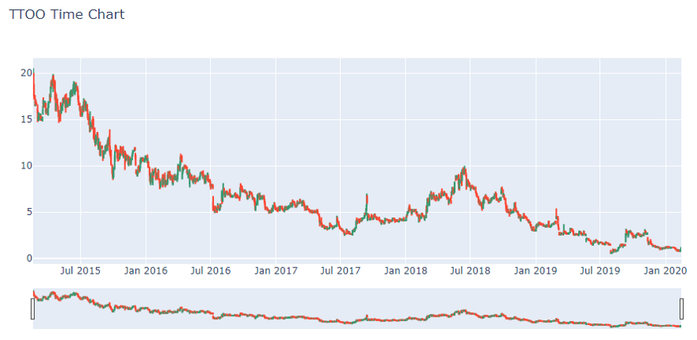

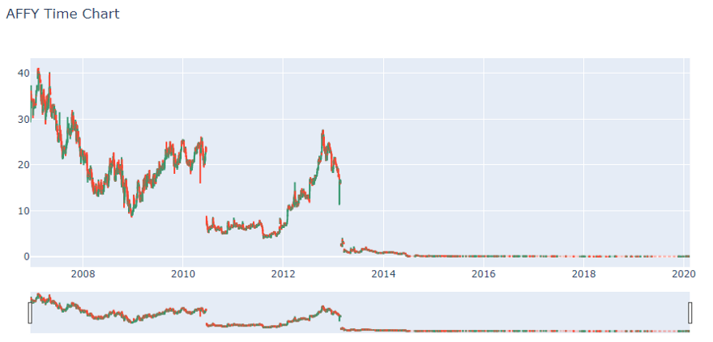

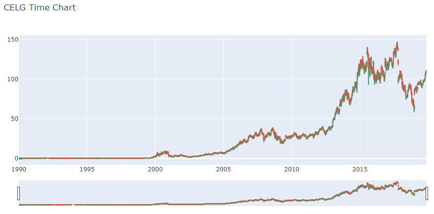

Even with information about the investment potential of biotech stocks, an investor could use help determining the best time to buy or sell a stock. Especially with the volatility of these stocks, there is great opportunity for small short term trading.  A 1% to 2% price change can provide a substantial trading profit with good buy and sell recommendations, and as can be seen below there is extensive price movement both up and down for these stocks. The below distributions represent the price change of one day from the Virtus LifeSci Biotech ETF (with the increases and decrease capped).

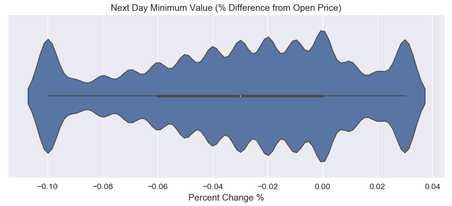

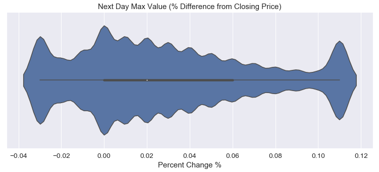 

</details>

#### Model Input

The stocks being looked at is from the Virtus LifeSci Biotech ETF. The ETF is focused on companies currently in clinical trials. Currently there are 96 companies in the ETF. The stock price information was obtained from Yahoo Finance API using the pandas datareader library get_data_yahoo() method. There are 148,088 data points, but that number will decrease with data processing. Below is the data pulled from the API. The price related features (High, Low, Open, Close, and Adj Close) were scaled the maximum price value of all of the features for a given stock. Volume was scaled by dividing by the maximum volume value. In addition to the price and volume data seen below a daily percent change of the opening price was added to the model input.

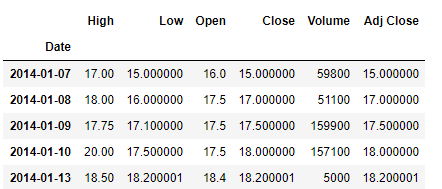 

#### Model Target

The target of the model is future stock pricing price. Originally I planned to the next day, 3 day, 10 day, and 30 day price, but I decided the just to model the next price for simplicity sake and because I questioned the usefulness of the longer dated predictions. So the model targets are the calculated percentage difference of the next day highs and lows versus the current day open price.

I also capped the percentage increases and decreases of the target values. The values were very skewed with increases stretching out to close to 7000% and the decrease going down to  -100%. The capping was done based on the statistical distribution of the calculated next day's high and low. See below original next day lows and the distribution after the increase and decrease were capped.

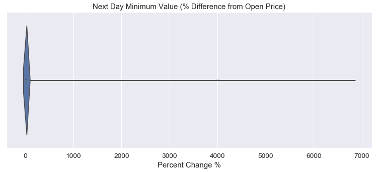 

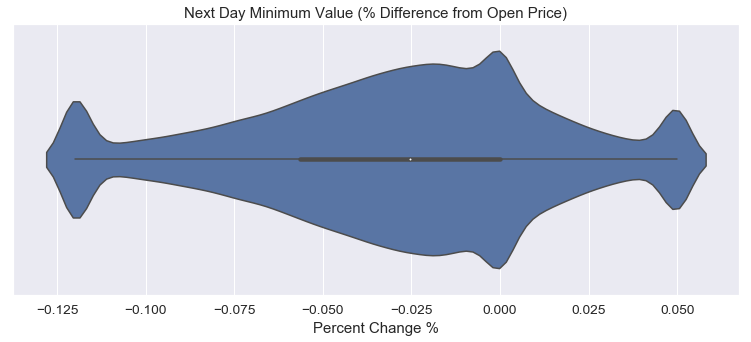 

The maximum increase and decrease was capped base on the 5th and 95th quantile percentages. Below are the range of values.

<ul>
	<li>Limiting next day lows to 12% decrease and 5% increase.</li>
    <li>Limiting next day highs to 5% decrease and 14% increase</li>
</ul>

#### Time Series Model
There is exactly two models one for the Next Day Low and one for the Next Day High. These two models have the same input but use the separate target for training. There multiple architectures that I considered, see below.


<details open>
<summary><strong>Gated Recurrent Unit (GRU) Recurrent Nueral Network (RNN)</strong></summary>
The GRU is the model that was choice. Although not a performing model, a regression output did produce exceptable R squared values. 
</details>


<details><summary>One Dimensional Convolutional Neural Network (CNN)</summary>
The 1D CNN and the combination RNN and CNN did not converge to the more accurate models, so they were discarded.
</details>

<details><summary>Pretrained Image Processing CNN (ResNet)</summary>
The pretrained image classification model show some promise, but the model input would have to be converted to a image tensor to be process by the network . The processing was too computationally intensive to be a workable solution. Below is example of the image that need to be created.
    
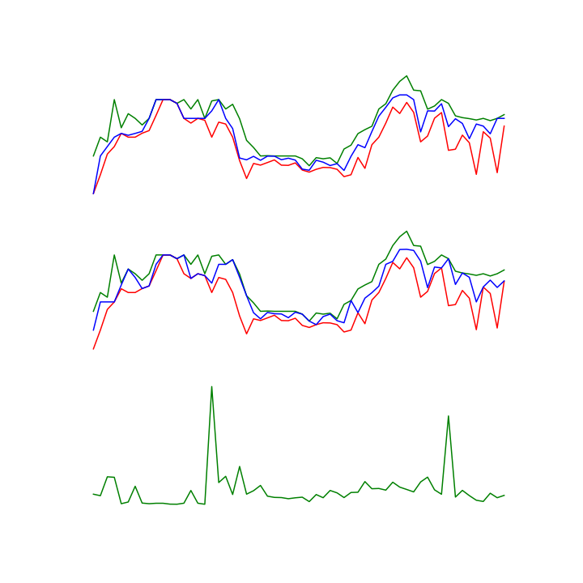 
</details>


<details><summary>Combination GRU and CNN</summary>
    
The combination RNN and CNN did not converge to the more accurate models, so they were discarded.

</details>

Model training entailed running 100 epoch training run for each of the 96 stock in the ETF. The last 100 trading days were used for validation. After this was completed, the model weights were saved as the base model for future training. Then an individual stock was trained using 6000 epoch long fit runs. Although mean squared error was used for the lost function, I saved the model weights for the final model by highest R squared value.

During the modeling formation process, I chose between a regression model and a classification model where the percentage changes where separated into bins that where one percent point wide. I leaned toward a classification model because I wanted the model output to be a probability distribution displaying  the chance given a percent increase or decrease would occur. Ultimately the classification model did not performed well for either high or low models because the output tended to the extremes of the percentage range. The regression was also not particularly good only 0.643- 0.646 R Squared for the high and low, but there was improvement in the model using the loss criteria mean squared error. See loss function and model output below.

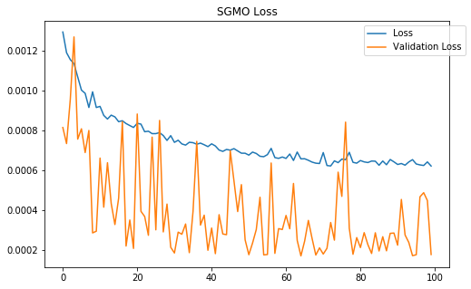 

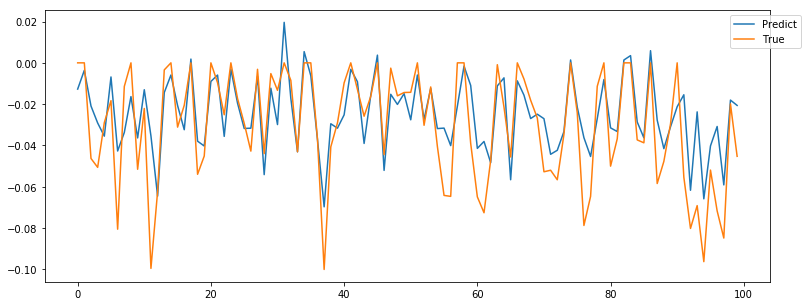 

#### Model Output 

In order to produce the probability distribution, I decided to use the residuals of the predicted values to create a normal distribution. Each model input took the last 1000 days of trading and fed they into the model. The residuals of the model were found using the actual next day values and predicted values. Then the capped target values describe earlier were removed from the analysis, because they would add a higher level variability in model then what was accurate.

Using median and standard deviation of the remaining residuals, I created a 10,000 sample simulations of normal distributions centered on the predicted value of either high or low model using the Numpy random.normal() method. These distributions where then graphed using the Plotly method, create_distplot(), removing the histogram just using the kernel density (KDE) plot line. The day's opening and closing(or current) price were plotted as vertical lines. Also recommended buy and sell points were graphed as points on the high and low KDE lines.


<details>
<summary><strong>Using the Results</strong></summary>

Knowledge of the stock in question is important. In particular because the R squared valued for modeled stock generally does not go over 0.65. A base of investor knowledge will act as a check on the short term predictions in the model.

Also avoiding the extremes of the model's range is important. Large percentage point moves are not the target of this model, because they are generally cause by events that cannot be predicted by the stock price inputs of the model. The model is trying to predict smaller changes less than 10% either negative or positive. Also with capping of losses and gains, big price movements are masked by the model. The horizontal axis of the graph is scaled to be at or near the capped values, so when the distributions are close to the edges of the graph , the trader should be cautious with buy and sell recommendations from the model.
</details>


#### Dashboard

Using the Dash App from Plotly , I constructed an interactive dashboard to display the model outputs. A representation of the dashboard can be seen below.


There are two prediction graphs. One for today's stock price based on the yesterday's  inputs, and one for tomorrow's pricing based on current pricing. In addition a time chart was added displaying the last 100 days of price movement using a candlestick chart. Plotted on top of the candlestick chart are the high and low prediction for each day. Last are the points were the model missed. Red markers indicate were the low prediction was higher then actual low, and green markers indicate were high prediction was too low compared to the actual high.

#### Conclusion and Future Work

In conclusion, stock modeling is very difficult even using machine learning techniques. My model's R squared values topped out around 0.65. That is not a particularly good model. But I used the uncertainty  of the model as a feature of the model and not just a limitation, in this case the residuals, greatly improving the model output. The dashboard provides an investor a good view of where the price could be going and suggested buy and sell points that an investor could use.

The opportunities for future work center around improving the model with better information. This model use daily price quotes because the were readily available and free, but stock price information is available for shorter periods down to the second. Also additional stock price measurement could be used like bollinger bands and volatility measures. In addition to model improvement, one could take the buy and sell recommendation of the model and build an automated trading program.


```python

```
